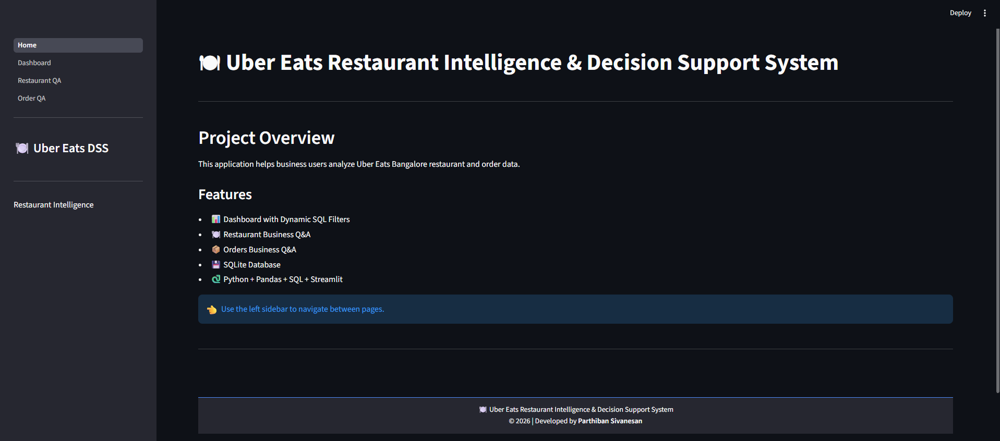
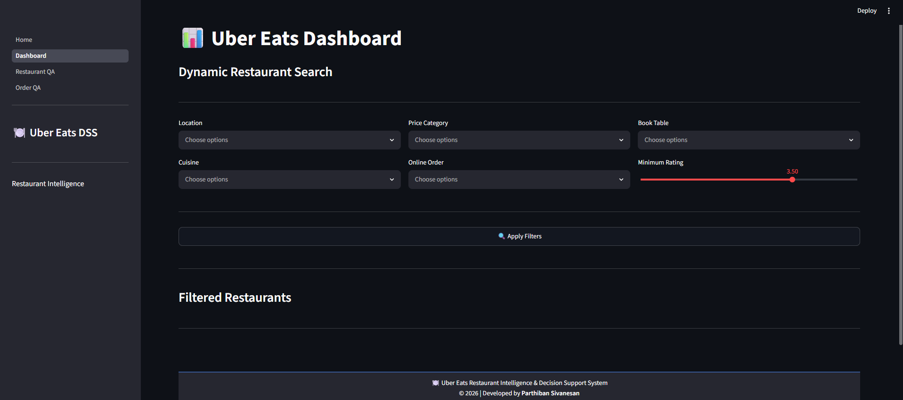
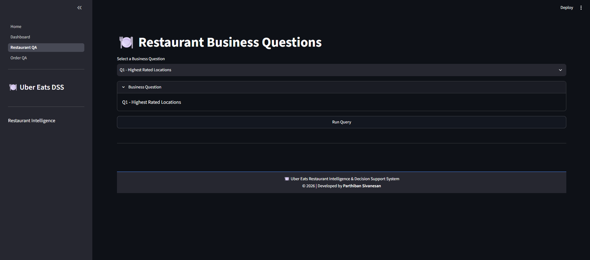
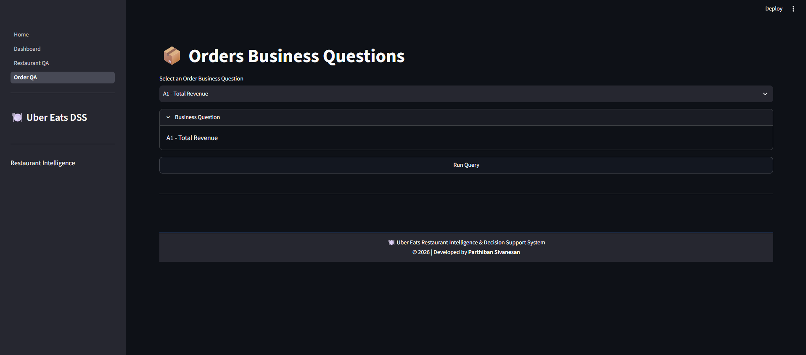

# 🍽️ Uber Eats Restaurant Intelligence & Decision Support System

## 📖 Project Overview

This project is a Restaurant Intelligence & Decision Support System developed using Python, Pandas, SQLite, SQL, and Streamlit.

The application analyzes Uber Eats Bangalore restaurant and order datasets to help business users make informed decisions through SQL-based analysis and interactive dashboards.

---

## 🚀 Features

### 📊 Dashboard

- Dynamic SQL-based filtering
- Filter by:
  - Location
  - Cuisine
  - Price Category
  - Online Order
  - Table Booking
  - Minimum Rating

---

### 🍽️ Restaurant Business Q&A

15 predefined business questions answered using SQL.

---

### 📦 Orders Business Q&A

12 SQL-based order analytics including JOIN operations.

---

## 🛠 Technologies Used

- Python
- Pandas
- SQLite
- SQL
- Streamlit
- Jupyter Notebook

---

## 📂 Project Structure

```
Uber_Eats_Project/
│
├── data/
├── database/
├── notebooks/
├── scripts/
├── streamlit/
│   ├── Home.py
│   └── pages/
├── requirements.txt
├── README.md
└── .gitignore
```

---

## ▶️ Installation

Clone the repository

```bash
git clone <repository-url>
```

Install dependencies

```bash
pip install -r requirements.txt
```

Run the application

```bash
streamlit run streamlit/Home.py
```

---

## 📸 Application Pages

- Home
- Dashboard
- Restaurant Business Q&A
- Orders Business Q&A

---

## 📈 Business Value

This application enables business users to:

- Analyze restaurant performance
- Compare locations
- Study pricing strategies
- Evaluate customer satisfaction
- Analyze revenue trends
- Support business expansion decisions

---

## 📸 Screenshots

### Home



### Dashboard



### Restaurant Q&A



### Orders Q&A



---

## 👨‍💻 Developed By

**Parthiban Sivanesan**
